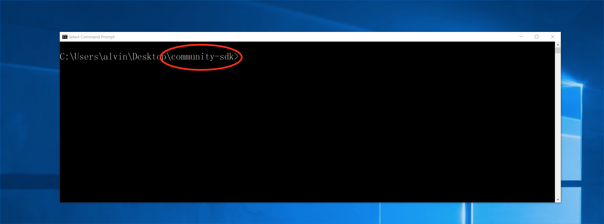
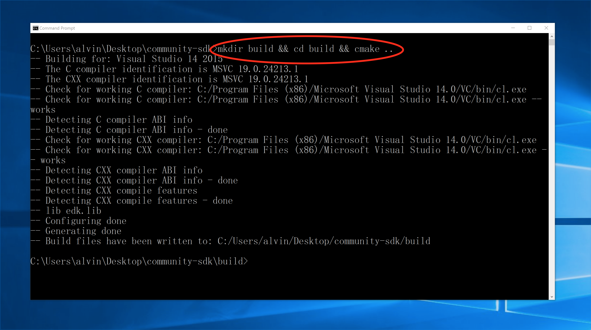
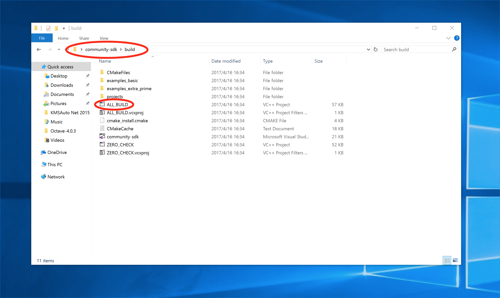
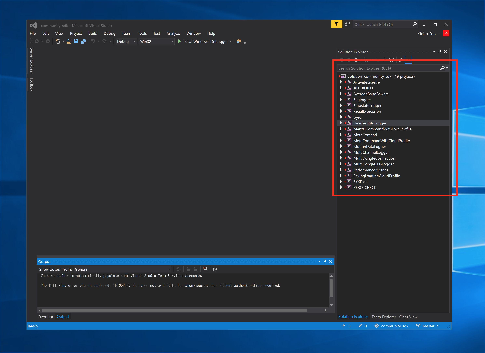
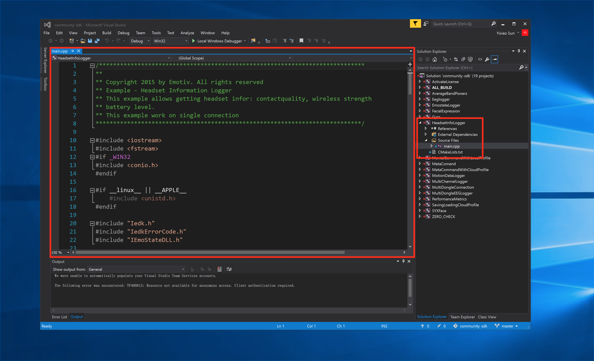
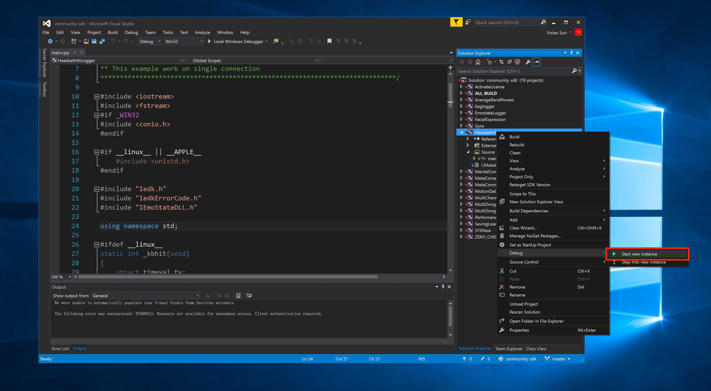
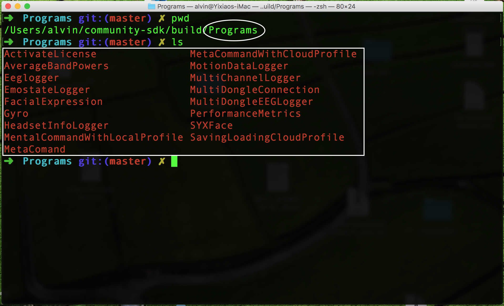

# How to Generate Example_Basic C++ Project Files with CMake

### Supported Platforms

1. [Windows](#windows)

	* [Prerequisite](#win-prereq)
	* [Generate Visual Studio Project Files](#win-cmake)

2. [Mac OS](#macos)

	* [Prerequisite](#mac-prereq)
	* [Generate Unix Makefile](#mac-cmake)

3. [Linux](#linux) (to be finished...)


## <div id="windows">Windows</div>

### <div id="win-prereq">Prerequisite</div>

1. CMake: Install from [here](https://cmake.org/download/)
2. Visual Studtio: Install from [here](https://www.visualstudio.com/zh-hans/vs/community/)
3. (Optional) Git: Install from [here](https://git-scm.com/downloads)

### <div id="win-cmake">Generate Visual Studio Project Files</div>

1. Download `community-sdk` from [my github repo](https://github.com/alvinsunyixiao/community-sdk/archive/master.zip)  
	If you're familiar with **Git Tools**, feel free to download the source code using the following command:
	
	```
	git clone https://github.com/alvinsunyixiao/community-sdk.git
	```
	
2. Open up your **Windows command prompt** (abbreviated as **cmd**), and change your current directory to your `community-sdk` folder

	

3. Run the following command to generate project files:

	```
	mkdir build && cd build && cmake ..
	```
	

4. Open the `ALL_BUILD` file inside your `community-sdk/build/` folder with [**Visual Studio**](https://www.visualstudio.com/zh-hans/vs/community/)

	

5. You will see a list of projects on the right 

	

6. You can either:
	* Edit the source code for each of the project

		
		
	* Run a specific project by doing the following

		 

## <div id="macos">Mac OS</div>

### <div id="mac-prereq">Prerequisite</div>

1. Homebrew: Install by typing the following command in your terminal application:

	```
	/usr/bin/ruby -e "$(curl -fsSL https://raw.githubusercontent.com/Homebrew/install/master/install)"
	```
2. CMake: **With Homebrew installed**

	```
	brew install cmake
	```

3. Git: **With Homebrew installed**

	```
	brew install git
	```
	
### <div id="mac-cmake">Generate Unix Makefile</div>

1. Download this git repository:

	```
	git clone https://github.com/alvinsunyixiao/community-sdk.git
	```
	
2. Change current directory into `/path/to/your/community-sdk/`

	**Hint**: normally you do `cd community-sdk` after cloning the git repository.

3. Create a `build/` folder within your `community-sdk/` folder and `cd` into `build/`

	```
	mkdir build && cd build
	```

4. Generate the Unix Makefile

	```
	cmake .. -DAPPLE=1
	```
	
5. Build projects

	```
	cmake --build ./                   	                 # Build all projects
	cmake --build ./ --target [project_name]             # Build a single project
	```
	
6. Run a project

	1. Get into the `Programs/` directory

		```
		cd Programs
		```
	2. List all compiled executable files

		```
		ls
		```
		
	
	3. Run one of them by typing `./[project_name]` (e.g. `./AverageBandPowers`)

## <div id="linux">Linux (To be finished...)</div>
